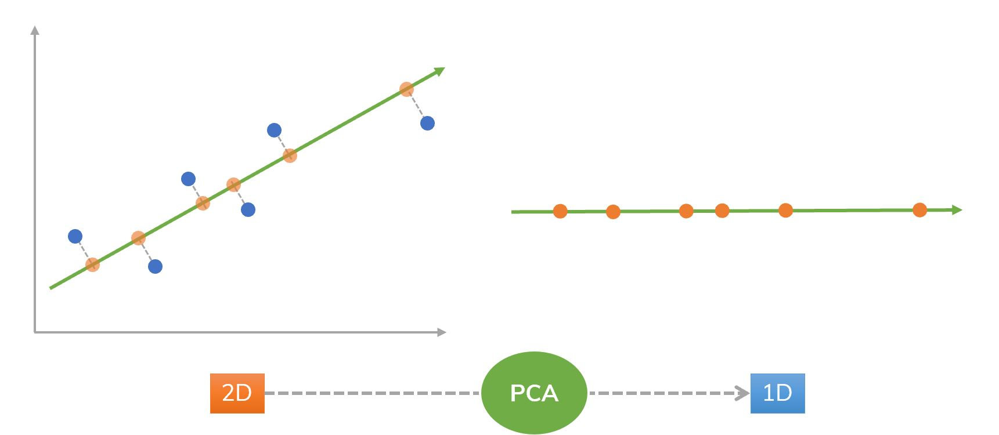

# Intuitive PCApproximation

**To the notebook:** https://deepnote.com/@notpaulmartin/PCApproximation-PIgieYKmR5aaz3DVjLKqdg

This is an exploration into Principal Component Analysis (PCA) with the aim to explain to myself (and potentially others) in an intuitive way how PCA works.

I managed to create an algorithm that, while not as efficient as typical implementations of PCA (e.g. [sklearn](https://scikit-learn.org/stable/modules/generated/sklearn.decomposition.PCA.html)), still runs reasonably quickly and, most importantly, is rather easy to understand – at least so I think.

**What is PCA?**  
PCA is a form of dimensionality reduction very commonly used in Data Science and Machine Learning. Most datasets contain a very large amount of variables, which makes it difficult to identify trends. PCA helps with this, as it reduces the number of variables while retaining as much variance (information) as possible. Visually, PCA works by plotting the points and then finding n orthogonal lines that maximise the variance, as seen in the image below. The spread of the points along these lines represent the n new variables.  

_Example:_  
To reduce a dataset from two variables to one, we first plot the points on a 2D plane and then find a single line that maximises their variance.  
  
_(Taken from https://dinhanhthi.com/principal-component-analysis/)_

**My approximation**  
Since the axes in euclidean geometry are already, by definition, orthogonal to one another, we can simply rotate them to maximise the variance along them. In 3D, we would first rotate the X-axis in any direction to maximise variance along it and then rotate the Y-axis while keeping the X-axis fixed and the Y-axis perpendicular to it. Once the variance has been maximised along both axes, the new variables are the X and Y-axes. This can be scaled up to any number of input and output variables.

Since rotating the axes is not really feasible, my algorithm rotates the points instead, but the idea remains the same.
